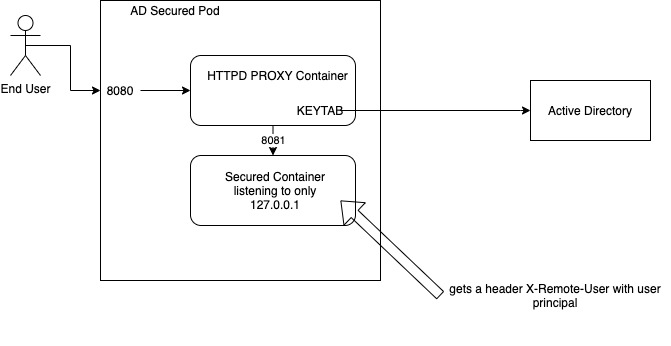

# Kerberos Sidecar Proxy
This repository demonstrates securing a pod with a sidecar that can perform challenge authentication with kerberos



## Prerequisites
* Computer bound to an Active Directory
* Keytab as an HTTP service principal
* Service account created to bind to the HTTP Kerberos Principal

# Generate Service Keytab
1. on a windows machine generate the keytab with
    ```
